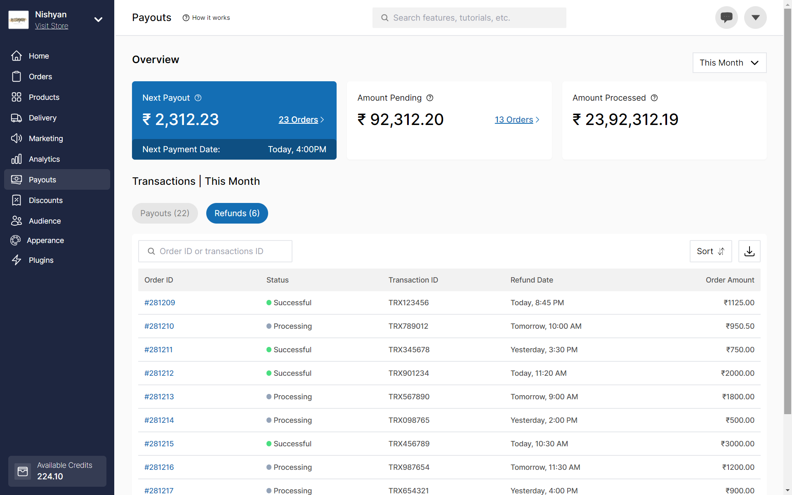
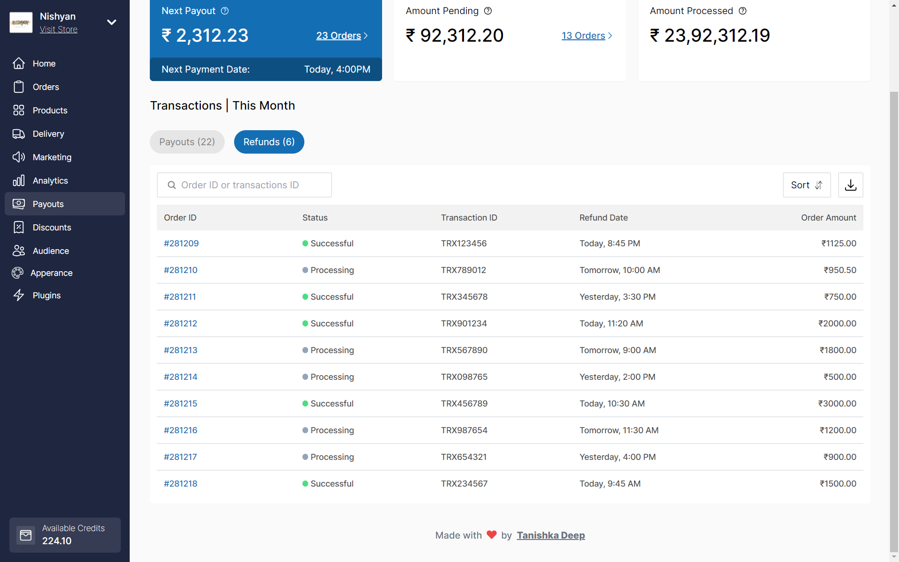

# Dukaan Dashboard Clone

Tech-Stack : React + TailwindCSS

## Setup

1. Clone the repository:

   ```
   git clone https://github.com/tanishkadeep/dukaan-dashboard-clone.git
   ```

2. Navigate into the project directory:

   ```
   cd dukaan-dashboard-clone
   ```

3. Install dependencies:
   ```
   npm install
   ```


## Screenshots



    

## Note
This project is currently not responsive. Future updates may include responsiveness.